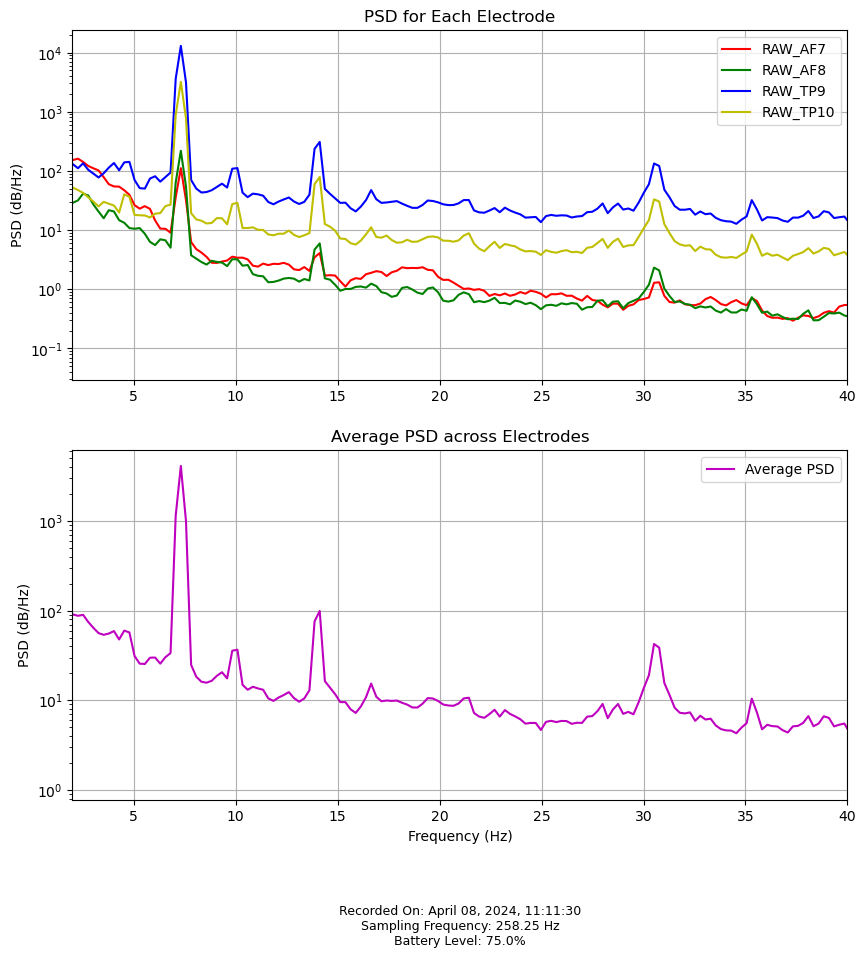

# Muse EEG Analysis Guide

This Jupyter notebook is designed for persons interested in tracking EEG biometrics using the Muse headband + Mind Monitor app for personal insights into frequecy based brain activity.

The aim is to help me preprocess my EEG data, visualize it, and extract potential biomarkers that could be indicative of various neurological conditions or states, such as ADHD or general brain health and how it changes over time.



## Full Disclosure

I've been learning about Neurofeedback for less than a week, so don't assume for a moment I know what I'm doing with your brain. Research into the best metrics when using EEG as a diagnostic tool is ongoing, and effectivness is often mixed due to the variability in peoples brains.

Just assume I dont know what I'm doing!

## GETTING STARTED

### What You Will Need...

- **Hardware**: Muse headband

- **Software**

  - **Mind Monitor** (app on ios /android appstore)
    - Mind Monitor Settings: - Recording Format: CSV - Recording Interval: Constant
  - **Dropbox** (required for exporting from the Mind Monitor app)

  - **Jupyter Notebook** or Google collab etc

### Data Collection Procedure...

1. Wear the Muse headband and ensure it's properly connected to the Mind Monitor app.
2. Adjust the Mind Monitor app settings as specified above.
3. Record 5 minutes of EEG data with your eyes closed, without engaging in active meditation.
4. Save the recording to Dropbox.

### Preparing the Data for Analysis...

After recording, extract the zip, and transfer the CSV file from Dropbox to this notebook's files directory for analysis.

## Analysis Steps

### Cell 1: Setting the Data Path

**Option 1 -auto** - just add your latest csv to the 'raw_data' folder and run the cell. The code will automatically use the newest file in that folder.

**Option 2 -manual** - uncomment option 2, and add the file_path manually

```python
# Define the path to your EEG data file
data_file = 'path/to/your/eeg_data.csv'
```

### Cell 2: Data Preprocessing and Visualization

1. This step involves preprocessing the EEG data to remove dropouts, and calculates a more accurate samplerate
2. Creates a graph overview to visualize the 4 electrodes from delta to beta to get the big picture.
3. saves the graph as a png for later in the /outputs/images folder

### Cell 3: Biomarker Extraction

1. Extract various potential biomarkers from the EEG data, such as:

- **DAR (Delta/Alpha Ratio)**: The latest potential indicator for adult ADHD.
- **TBR (Theta/Beta Ratio)**: The most common indicator for child ADHD.

- **TAR (Theta/Alpha Ratio)**: A straight forward indicator for anxiety. most biofeedback aims to push up alpha
- **BAR (Beta/Alpha Ratio)**: A less obvious approach for anxiety, is to push down beta, which will allow more alpha as the two work together in counter to each other

- **Average PAF (Peak Alpha Frequency)**: Considered a marker for general brain health. 10hz is good. 8hz means you are old or lacking sleep

2. Save the Biometrics to an ongoing CSV file for future visualisation

## Good luck! 
Hopfully the collection of these bio markers over time should highlight what lifestyle changes or neurofeedback techniques are effective


